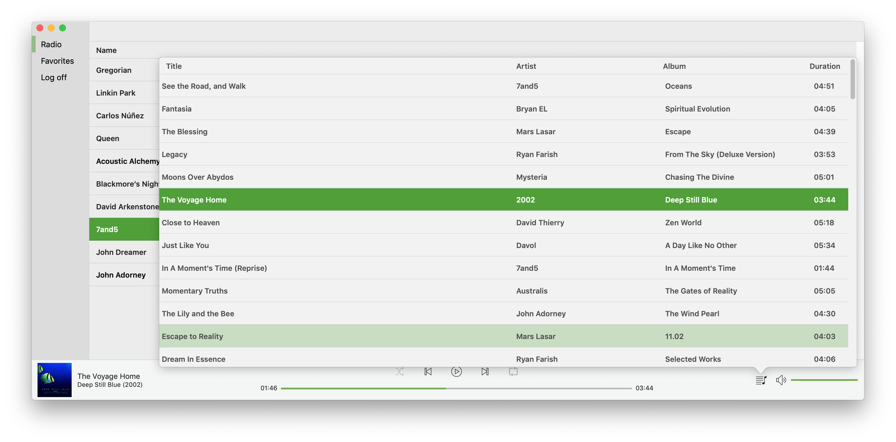

# Google Music Player is a native macOS client for Google Play Music

Standalone native macOS app for Google Play Music. Never again use browser for listening the music :)

No affiliation with Google. Google Play is a trademark of Google Inc.

## Requirements
- macOS 10.14 Mojave
- Google Play Music subscription

## Download
Download latest version on [Releases](https://github.com/reloni/GoogleMusicClient/releases) page.

## Features
This is early preview, only radio stations supported. In order to see radio station in app it should be added to user media library.
- Native macOS light and dark themes
- Media keys support (play, pause, next, previous)
- Radio station playback

## Screenshots
<table>
  <tr>
    <th width="50%"></th>
    <th width="50%">
  </tr>
  <tr>
  <th width="50%"></th>
  <th width="50%">
  </tr>
</table>
